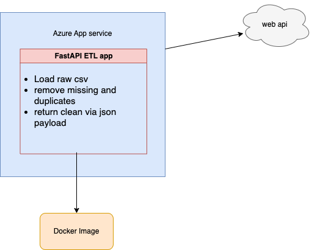

# PYPELINE  
A data pipeline utility api.  

The microservice allows users to create data pipelines for tasks such as data extracting missing data and removing duplicates and loading the clean data into their desired destination. 

Users create new pipelines to extract data from a weblink to the raw file, transform the data using and get back the payload in json.

The pipeline utility handles the task of checking for duplicates and missing values, and providing a data quality report of the uploaded data .

## Architecture

## How it works
- parse a link to raw csv
- get data quality summary
- request specific cleaning action
- get back json payload

## Technologies used

- FastApi
- Azure app service. Api available [here](https://pypeline.azurewebsites.net/docs)
- Docker image available [here](https://hub.docker.com/r/lornamariak/pypeline)
